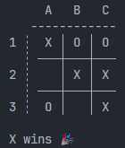

# First Step to Game AI - Unbeatable Tic-Tac-Toe AI

## How to run

### Console



Run in terminal

``` bash
cd frontends/
python -m console -X human -O minimax
```

Or modify code in `frontends/play.py` and run

``` bash
python frontends/play.py
```

## New knowledges learned from this projects

- Using `enum.Enum` in python class 
- Define mixin class `Mark(str, enum.Enum)`
- Using a `@property` for a class
- Using `from __future__ import annotations` to postponed evaluation of annotations
- Using `@dataclass(frozen=True)` to make a class with immutable instances
- Learning some regex syntax
    
    - `[^...]`: NOT ONE of the character
    - `\s` (lowercase s): matches a whitespace (blank, tab \t, and newline \r or \n)
    - `{m}`: The preceding item is matched exactly m times
    - `$`: matches the end-of-line excluding newline, or end-of-input (for input not ending with newline)
    - `\?`: escape for `?`

    > For example: 
        > - `"^[\sXO]{9}$"` mean string with 9 character contain only X, O and whitespace
        > - `"\?"` mean string that have ?

- Using `@cached_property` to ensure code is run at most once
- Data transfer object (DTO) whose main purpose is to carry data
- Using some more things in `typing`. 

    - `TYPE_CHECKING`: It's false at runtime, but third-party tools, such as `mypy`, will pretend it’s true when performing static type checking to allow the import statement to run
    - `Callable`: generic type that represents a callable object, can be called using the function call syntax `()`
    - ~~`TypeAlias`: Pass a name to a type to easy code reading~~ (Do not support in python 3.8)
    - `Iterable`: a generic type that represents any object that can be iterated over, can be iterated with `for`
    - `NameTuple`: a generic type to make the code slightly cleaner and more expressive

- Don’t need to use the pass statement or the ellipsis literal (...) as a class body placeholder if you use a docstring, which can provide additional documentation.
- `abc`: An abstract class is one that you can’t instantiate because its objects wouldn’t stand on their own

    - `abc.ABCMeta`: You can mark a class as abstract in Python by setting its metaclass to this
    - `@abc.abstractmethod`: an abstract method, which you must implement in concrete subclasses

- Using the `metaclass` argument instead of extending the base class is slightly more flexible, as it doesn’t affect your inheritance hierarchy
- Using Walrus operator `:=` to simplify the calling code. This operator allows you to assign a value to a variable as part of an expression
- ANSI escape code

    - `\033`: non-printable `Esc` character, which starts a special code sequence
    - `\033[`: Control Sequence Introducer (`CSI`) [Link](https://en.wikipedia.org/wiki/ANSI_escape_code#CSI_(Control_Sequence_Introducer)_sequences)
    - `CSI n m`: Select Graphic Rendition (`SGR`) [Link](https://en.wikipedia.org/wiki/ANSI_escape_code#SGR_(Select_Graphic_Rendition)_parameters)

    > For example: 
    > - `\033[0m`: Reset or normal, All attributes become turned off
    > - `\033[5m`: Slow blink, Sets blinking to less than 150 times per minute

- Using the `textwrap` module to remove the indentation
- Using unicode emojis

    - `\N{party popper}` will render the 🎉 emoji
    - `\N{neutral face}` will render the 😐 emoji

- Using `functools.partial()` to produce a new function with fewer parameters by prepopulating one or more of the original function’s arguments with concrete values

## TODO

- Continue [Step 4: Equip the Computer With Artificial Intelligence](https://realpython.com/tic-tac-toe-ai-python/#step-4-equip-the-computer-with-artificial-intelligence) to create unnbeatble AI bot

## Reference

- [Build a Tic-Tac-Toe Game Engine With an AI Player in Python](https://realpython.com/tic-tac-toe-ai-python/)
- [Minimax in Python: Learn How to Lose the Game of Nim](https://realpython.com/python-minimax-nim/)
- [Regular Expressions (Regex)](https://www3.ntu.edu.sg/home/ehchua/programming/howto/Regexe.html)
- [ANSI escape code](https://en.wikipedia.org/wiki/ANSI_escape_code)